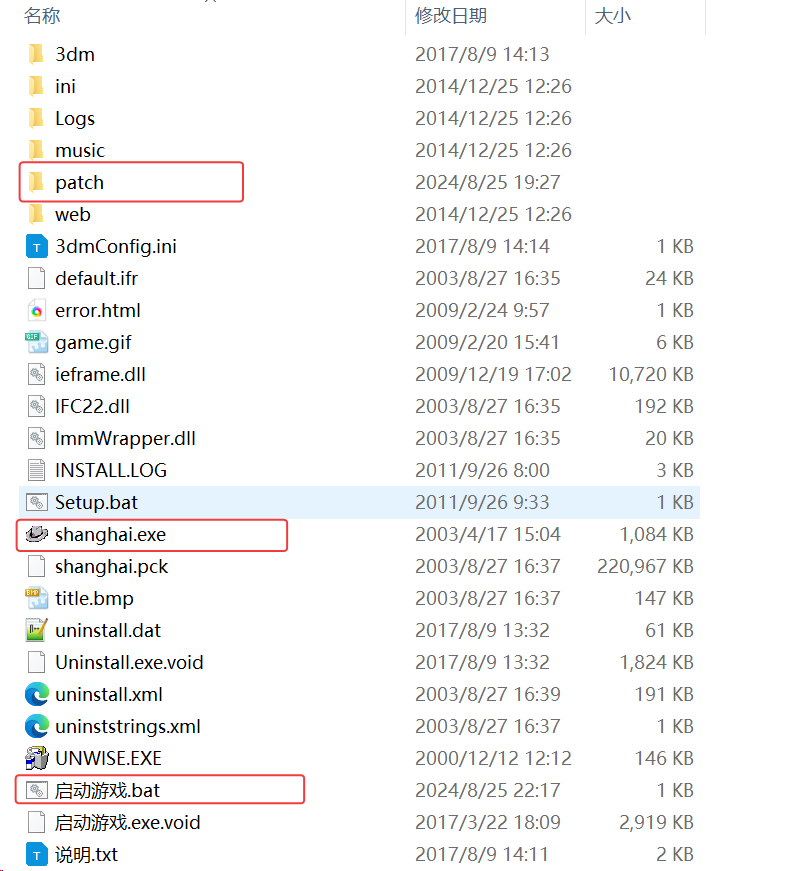

win10下全屏启动 血战上海滩 脚本

任务栏隐藏和显示参考[在Windows10上安装血战上海滩](https://ntutn.top/posts/%E5%9C%A8windows10%E4%B8%8A%E5%AE%89%E8%A3%85%E8%A1%80%E6%88%98%E4%B8%8A%E6%B5%B7%E6%BB%A9/)编译

解压后需要确保启动脚本和shanghai.exe在同一级目录，如图

可能需要.net8，[官网下载地址](https://dotnet.microsoft.com/zh-cn/download)